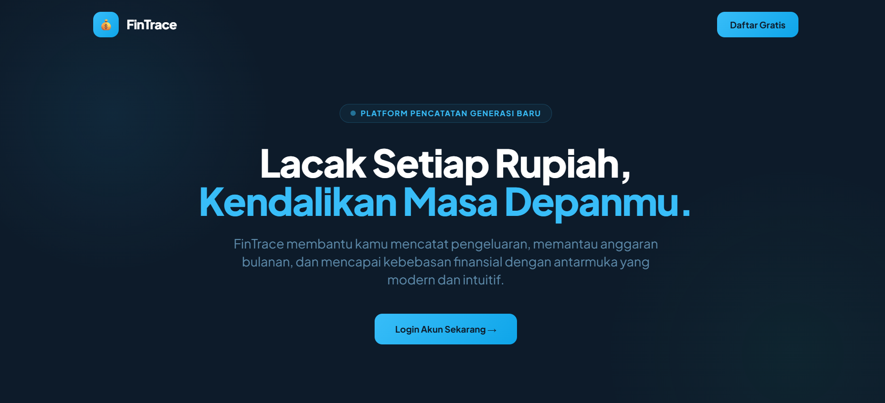
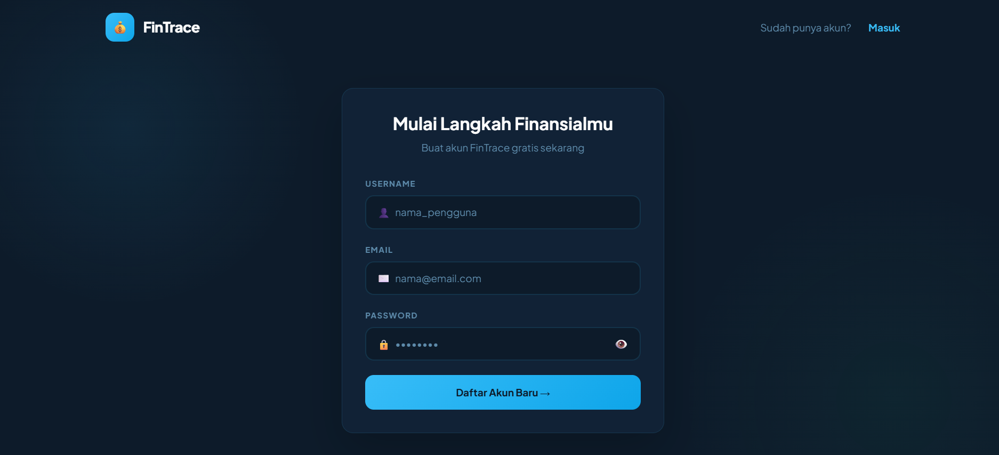
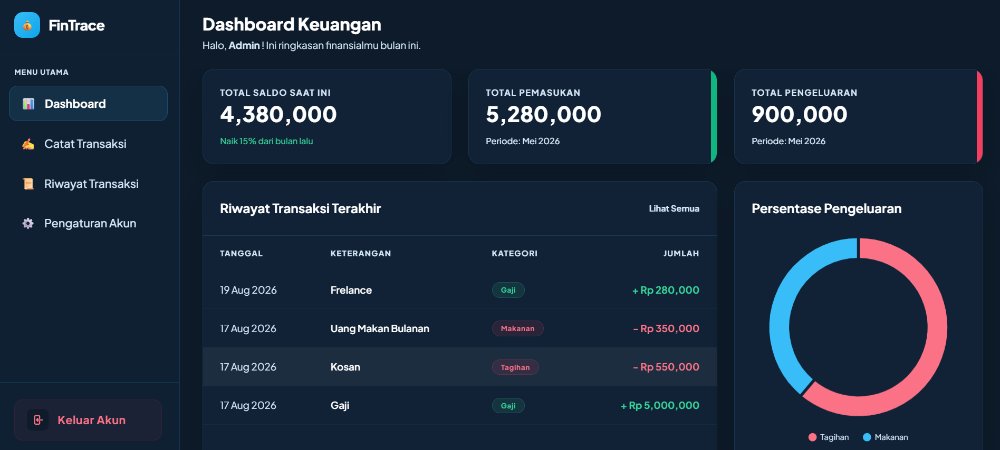

# 💰 FinTrace – Dashboard Keuangan Pribadi

FinTrace adalah aplikasi berbasis web untuk mencatat, melacak, dan menganalisis transaksi keuangan harian secara privat dan real-time.  
Dibangun menggunakan **Flask** sebagai backend dan **Chart.js** untuk visualisasi data di frontend.

##  Index

### Login

### Register

### Dashboard

### Catat Transkasi

### Riwayat Transaksi

### Pengaturan Akun

  

> Klik gambar di atas untuk menonton demo aplikasi.

---

## 🚀 Fitur Utama

- **Autentikasi Aman** — Registrasi dan login pengguna dengan session-based authentication
- **Manajemen Transaksi Privat** — Pencatatan pemasukan dan pengeluaran yang terisolasi per pengguna
- **Kalkulasi Saldo Otomatis** — Ringkasan total saldo, pemasukan, dan pengeluaran secara real-time
- **Visualisasi Pengeluaran** — Doughnut chart dinamis untuk melihat distribusi pengeluaran berdasarkan kategori
- **Riwayat Transaksi** — Tabel kronologis aktivitas keuangan pengguna

---

## 🛠️ Teknologi yang Digunakan

- **Backend:** Python, Flask
- **Frontend:** Tailwind CSS, Chart.js, Plus Jakarta Sans
- **Database:** MySQL
- **Version Control:** Git & GitHub
